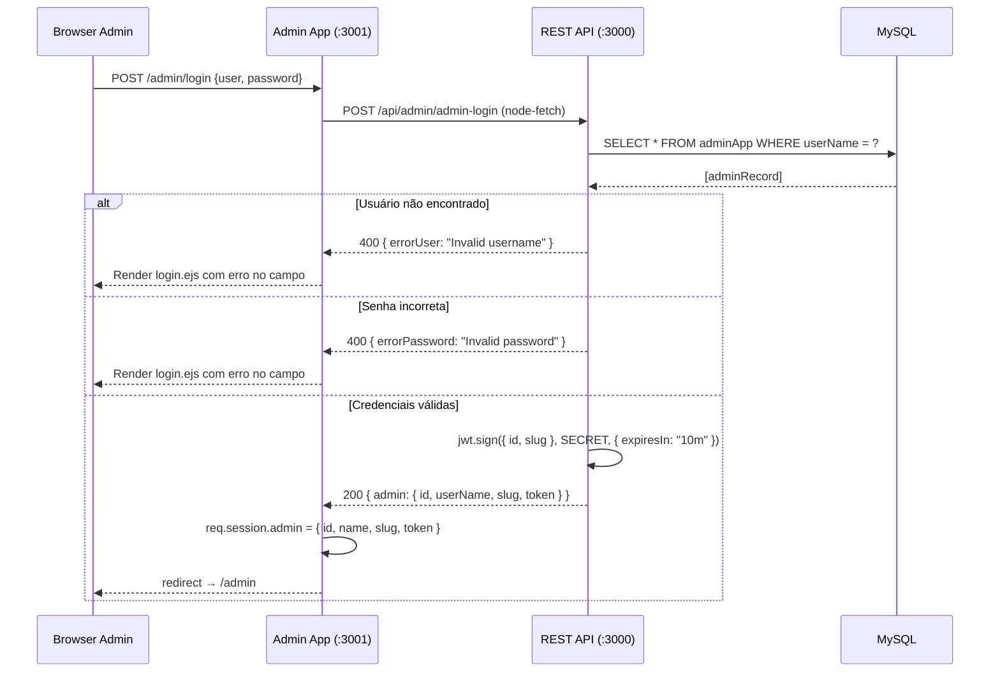
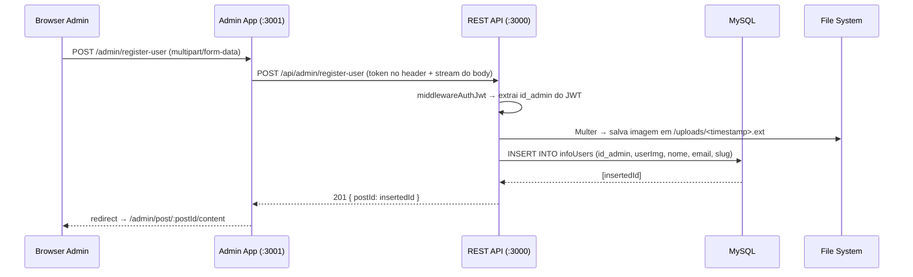
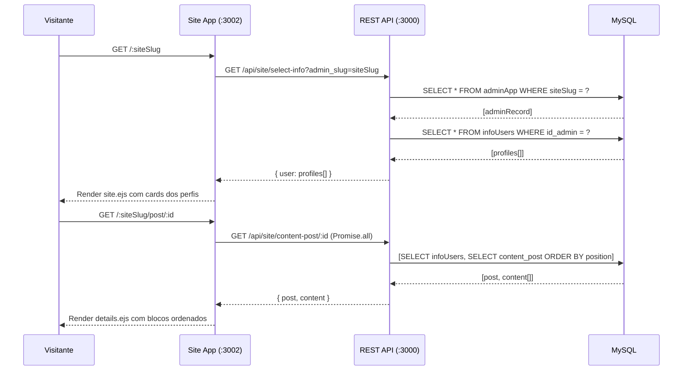
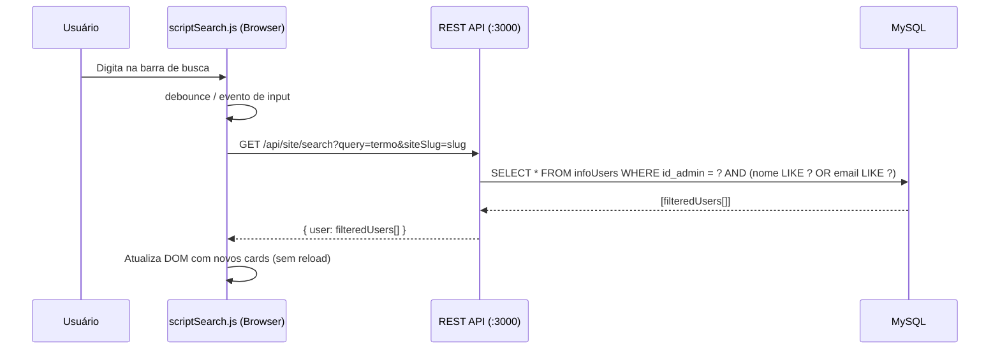

<div align="center">

# 🚀 Exploring-nodejs - API REST com Painel Administrativo e Site Público

### *Multi-App Platform with Administrative Webapp, REST API and Public Site*

> Plataforma full stack com três aplicações Node.js independentes, autenticação JWT, painel administrativo SSR e site público multi-tenant — desenvolvida para demonstrar domínio em arquitetura modular, segurança por camadas e integração entre serviços.

<br/>


</div>

---

## 📋 Índice

- [Visão Geral](#-visão-geral)
- [Demonstração Visual](#-demonstração-visual)
- [Funcionalidades](#-funcionalidades)
- [Arquitetura do Projeto](#-arquitetura-do-projeto)
- [Estrutura de Pastas](#-estrutura-de-pastas)
- [Tecnologias Utilizadas](#-tecnologias-utilizadas)
- [Conceitos Técnicos Demonstrados](#-conceitos-técnicos-demonstrados)
- [Fluxo do Sistema](#-fluxo-do-sistema)
- [Banco de Dados](#-banco-de-dados)
- [Endpoints da API](#-endpoints-da-api)
- [Como Executar](#-como-executar)
- [Variáveis de Ambiente](#-variáveis-de-ambiente)

---

## 🌐 Visão Geral

**Exploring-nodejs** é uma plataforma **multi-tenant** e **multi-aplicação** construída inteiramente com Node.js. O sistema é composto por três aplicações independentes que se comunicam através de uma REST API centralizada:

| Aplicação | Descrição | Porta |
|-----------|-----------|-------|
| **`apps/api`** | REST API centralizada — coração do sistema | `:3000` |
| **`apps/admin`** | Painel administrativo SSR — gerencia todo o conteúdo | `:3001` |
| **`apps/site`** | Site público SSR — exibe os perfis criados pelos admins | `:3002` |

O grande diferencial arquitetural é o **modelo multi-tenant via slug**: cada administrador possui um `siteSlug` único, e a partir dele é gerada uma URL pública exclusiva (`/:siteSlug`) que exibe apenas os dados registrados por aquele admin — sem interferência entre contas.

---

## 🎨 Demonstração Visual

### Fluxo Geral das Aplicações

```
┌─────────────────────────────────────────────────────────────────┐
│                        USUÁRIO ADMIN                            │
│  Browser → :3001/admin  →  Admin App (SSR/EJS)                 │
│                              │                                   │
│                    node-fetch (HTTP interno)                     │
│                              ↓                                   │
│              ┌──────────────────────────────┐                   │
│              │     REST API  :3000          │                   │
│              │  JWT Auth + Knex + MySQL     │                   │
│              └──────────────────────────────┘                   │
│                              │                                   │
└──────────────────────────────┼──────────────────────────────────┘
                               │
┌──────────────────────────────┼──────────────────────────────────┐
│                        VISITANTE                                │
│  Browser → :3002/:slug  →  Site App (SSR/EJS)                  │
│                    node-fetch (HTTP interno)                     │
│                              ↓                                   │
│              ┌──────────────────────────────┐                   │
│              │     REST API  :3000          │                   │
│              └──────────────────────────────┘                   │
└─────────────────────────────────────────────────────────────────┘
```

### Telas do Sistema

> **📸 Screenshots — Placeholders**
>
> | Tela | Descrição |
> |------|-----------|
> | `[ Login Admin ]` | Formulário de autenticação com feedback de erros por campo |
> | `[ Dashboard Admin ]` | Painel lateral com navegação e listagem de usuários |
> | `[ Cadastro de Perfil ]` | Formulário com upload de imagem e slug único |
> | `[ Editor de Post ]` | Construtor de conteúdo com blocos: text, title e image |
> | `[ Gerenciar Usuários ]` | Listagem com ação de exclusão e exportação para Excel |
> | `[ Site Público ]` | Grid de cards com busca dinâmica via Fetch API |
> | `[ Detalhes do Post ]` | Visualização ordenada de blocos de conteúdo |

---

## ✨ Funcionalidades

### 🔐 Autenticação & Segurança
- Login administrativo com validação de credenciais por campo (`errorUser` / `errorPassword`)
- Geração de **JWT** com payload `{ id, slug }` e expiração de **10 minutos**
- Middleware de autenticação **duplo**: sessão no Admin App + Bearer Token na API
- Proteção de rotas no Admin App via `express-session`
- Proteção de rotas na API via JWT (`Authorization: Bearer <token>`)
- Logout com destruição de sessão via `session.destroy()`

### 🗂️ Administração de Perfis (CRUD)
- Cadastro de perfis de usuários com **upload de imagem** (JPG/PNG)
- Associação automática do perfil ao admin autenticado (`id_admin` extraído do JWT)
- Listagem de perfis filtrados por admin autenticado
- Exclusão de perfil com verificação dupla de propriedade (`id` + `id_admin`)

### 📝 Construtor de Conteúdo (Post Builder)
- Adição de blocos de conteúdo por perfil: **`text`**, **`title`** e **`image`**
- Controle de **posicionamento** dos blocos (`position_content`)
- Upload de imagens de conteúdo em diretório separado (`uploads-content/`)
- Validação server-side por tipo de conteúdo

### 🌍 Site Público Multi-Tenant
- Rota dinâmica `/:siteSlug` — cada slug gera um site exclusivo
- Renderização de perfis via SSR (EJS)
- Página de detalhes de post (`/:siteSlug/post/:id`) com conteúdo ordenado por posição
- Busca dinâmica **client-side** com Fetch API (sem reload de página)

### 📊 Exportação de Dados
- Exportação da base de dados de perfis para **arquivo Excel** (`.xlsx`)
- Geração server-side com **ExcelJS** — colunas mapeadas dinamicamente
- Download direto via response stream

### 📁 Upload de Arquivos
- Upload de imagens de perfil e de conteúdo via **Multer**
- Factory function `createUpload(destination)` — reutilizável para múltiplos destinos
- Filtro de tipos de arquivo (`image/jpeg`, `image/png`)
- Nomenclatura de arquivo baseada em timestamp para evitar colisões

---

## 🏗️ Arquitetura do Projeto

### Padrão: Monolito Modular + Client-Server Distribuído

O projeto adota uma arquitetura de **três serviços independentes** que se comunicam internamente via HTTP (usando `node-fetch`). Essa abordagem traz benefícios de separação de responsabilidades sem a complexidade de um ambiente de microserviços real.

```
┌─────────────────────────────────────────────────────────────────────┐
│                         CAMADA DE APRESENTAÇÃO                       │
│                                                                       │
│   ┌───────────────────────┐      ┌───────────────────────────────┐  │
│   │    Admin App (:3001)   │      │      Site App (:3002)          │  │
│   │  Express + EJS + TW   │      │    Express + EJS + TW         │  │
│   │  Session Auth          │      │    Public (sem auth)           │  │
│   │                        │      │    Client-side search (JS)     │  │
│   └──────────┬────────────┘      └──────────────┬────────────────┘  │
│              │ node-fetch                        │ node-fetch         │
└──────────────┼───────────────────────────────────┼───────────────────┘
               │                                   │
┌──────────────▼───────────────────────────────────▼───────────────────┐
│                         CAMADA DE API REST (:3000)                    │
│                                                                        │
│   ┌──────────────┐  ┌────────────────┐  ┌────────────────────────┐   │
│   │   Routes     │  │  Middleware    │  │  Multer Config         │   │
│   │  /api/admin  │  │  JWT Auth      │  │  createUpload()        │   │
│   │  /api/site   │  │                │  │  fileFilter            │   │
│   └──────┬───────┘  └────────────────┘  └────────────────────────┘   │
│          │                                                             │
│   ┌──────▼──────────────────────────────────────────────────────┐    │
│   │                      Controllers                              │    │
│   │  adminMakeLogin | adminRegisterUser | adminManageUsers       │    │
│   │  adminDeleteUser | adminCreateContentPost | exportDataDb     │    │
│   │  selectUsers | selectContentPost | searchDb                  │    │
│   └──────────────────────────────┬───────────────────────────────┘    │
│                                  │ Knex Query Builder                  │
└──────────────────────────────────┼─────────────────────────────────────┘
                                   │
┌──────────────────────────────────▼─────────────────────────────────────┐
│                        CAMADA DE DADOS (MySQL)                          │
│                                                                          │
│   ┌──────────────┐    ┌────────────────────┐    ┌──────────────────┐   │
│   │   adminApp   │    │    infoUsers        │    │  content_post    │   │
│   │  id_admin PK │───▶│  id PK             │───▶│  id_post PK      │   │
│   │  userName    │    │  id_admin FK        │    │  id_card FK      │   │
│   │  userPassword│    │  userImg            │    │  type_content    │   │
│   │  siteSlug    │    │  nome, email, slug  │    │  content         │   │
│   └──────────────┘    └────────────────────┘    │  position_content│   │
│                                                   │  image           │   │
│                                                   └──────────────────┘   │
└──────────────────────────────────────────────────────────────────────────┘
```

### Separação de Responsabilidades

| Camada | Responsabilidade |
|--------|-----------------|
| **Routes** | Mapear endpoints HTTP para controllers; aplicar middlewares |
| **Middleware** | Interceptar requisições para validar autenticação antes de chegar ao controller |
| **Controllers** | Orquestrar a lógica de negócio: validar dados, chamar o banco, retornar resposta |
| **Database** | Configurar e expor a instância única do Knex (`dbKnex`) |
| **Multer Config** | Encapsular criação de instâncias de upload com diferentes destinos |

---

## 📁 Estrutura de Pastas

```bash
apps/
├── api/                            # REST API — backend central
│   ├── controllers-api/
│   │   ├── admin-controllers.js    # Lógica administrativa (CRUD + JWT + Excel)
│   │   └── website-controllers.js  # Lógica pública (listagem + busca)
│   ├── routes-api/
│   │   ├── admin-routes.js         # Rotas protegidas por JWT (/api/admin/*)
│   │   └── website-routes.js       # Rotas públicas (/api/site/*)
│   ├── middlewares/
│   │   └── auth-jwt.js             # Middleware de validação de Bearer Token JWT
│   ├── multer/
│   │   └── multer-config.js        # Factory de upload com destino configurável
│   ├── database/
│   │   ├── db-connection.js        # Instância singleton do Knex com pool MySQL
│   │   └── db_test_api.sql         # Script de criação do banco e seed inicial
│   ├── uploads/                    # Imagens de perfil (servidas em /uploads)
│   ├── uploads-content/            # Imagens de conteúdo (servidas em /uploads-content)
│   ├── .env                        # Variáveis de ambiente (HOST, DB, JWT_SECRET…)
│   ├── package.json
│   └── server.js                   # Entry point: inicializa Express + testa DB antes de subir
│
├── admin/                          # Painel Administrativo — webapp SSR
│   ├── controllers/
│   │   └── admin-controllers.js    # Controllers que chamam a API via node-fetch
│   ├── routes/
│   │   └── admin-routes.js         # Rotas do painel protegidas por sessão
│   ├── middlewares/
│   │   └── middleware-auth.js      # Middleware de proteção por session.admin
│   ├── views/
│   │   ├── pages/
│   │   │   ├── login/login.ejs     # Tela de login com feedback de erro por campo
│   │   │   ├── index.ejs           # Dashboard (página inicial do admin)
│   │   │   ├── register-info/      # Formulário de cadastro de perfil + upload
│   │   │   ├── send-post/          # Editor de blocos de conteúdo
│   │   │   └── admin-manage/       # Gerenciamento e exclusão de perfis
│   │   └── includes/
│   │       ├── sidebar.ejs         # Sidebar de navegação reutilizável
│   │       └── footer.ejs          # Rodapé reutilizável
│   ├── public/
│   │   ├── js/
│   │   │   ├── sidebar.js          # Toggle do menu lateral (responsividade)
│   │   │   └── post.js             # Interações da página de post
│   │   ├── input.css               # Entrada Tailwind
│   │   └── output.css              # CSS compilado pelo Tailwind CLI
│   ├── .env
│   ├── package.json
│   └── app.js                      # Entry point: Express + Session + EJS
│
└── site/                           # Site Público — webapp SSR multi-tenant
    ├── controllers/
    │   └── site-controllers.js     # Controllers que chamam a API via node-fetch
    ├── routes/
    │   └── site-routes.js          # Rotas dinâmicas /:siteSlug e /:siteSlug/post/:id
    ├── views/
    │   ├── pages/
    │   │   ├── site.ejs            # Listagem de cards + barra de busca
    │   │   └── details-post/
    │   │       └── details.ejs     # Renderização ordenada de blocos de conteúdo
    │   └── includes/
    │       ├── navbar.ejs          # Barra de navegação reutilizável
    │       └── card.ejs            # Componente de card de perfil
    ├── public/
    │   ├── js/
    │   │   └── scriptSearch.js     # Busca dinâmica com Fetch API (sem SSR)
    │   └── css/
    │       └── output.css          # CSS compilado pelo Tailwind CLI
    ├── package.json
    └── app.js                      # Entry point: Express + EJS
```

---

## 🛠️ Tecnologias Utilizadas

### Backend

| Tecnologia | Versão | Papel no Sistema | Por que foi escolhida |
|------------|--------|-----------------|----------------------|
| **Node.js** | 22.x | Runtime de todas as três aplicações | Não-blocante, ideal para I/O intensivo (uploads, chamadas HTTP internas, queries) |
| **Express.js** | 5.x | Framework HTTP para API e webapps | Minimalista e flexível, permite estrutura de middleware composável |
| **Knex.js** | 3.x | Query builder + gerenciamento de pool | Abstrai SQL sem o overhead de um ORM completo; suporte nativo a pool de conexões |
| **mysql2** | 3.x | Driver MySQL | Alta performance, suporte a Promises e compatível com Knex |
| **jsonwebtoken** | 9.x | Geração e verificação de JWT | Padrão de mercado para autenticação stateless em APIs REST |
| **express-session** | 1.x | Gerenciamento de sessão no Admin App | Mantém estado de autenticação no lado do servidor para a webapp administrativa |
| **Multer** | 2.x | Upload de arquivos multipart/form-data | Middleware maduro com suporte a `diskStorage` e filtro de tipos |
| **ExcelJS** | 4.x | Geração de arquivos `.xlsx` | API programática rica para criar planilhas com colunas mapeadas dinamicamente |
| **node-fetch** | 3.x | Chamadas HTTP entre os serviços | Permite que Admin App e Site App consumam a API REST internamente |
| **dotenv** | 17.x | Carregamento de variáveis de ambiente | Separação de configuração e código; essential para 12-Factor App |
| **cors** | 2.x | Política de CORS na API | Permite que clientes de origens distintas consumam a API |
| **body-parser** | 2.x | Parse de corpos de requisição | Suporte a `urlencoded` para formulários HTML |

### Frontend (SSR)

| Tecnologia | Papel no Sistema |
|------------|-----------------|
| **EJS** | Template engine server-side para renderização de HTML dinâmico |
| **Tailwind CSS 4.x** | Utilitário CSS para estilização sem CSS customizado; compilado via CLI |
| **Vanilla JavaScript** | Busca dinâmica client-side (`scriptSearch.js`) e interações do sidebar |

### DevTools

| Tecnologia | Papel |
|------------|-------|
| **Nodemon** | Hot reload durante desenvolvimento das três aplicações |
| **Tailwind CLI** | Compilação do CSS via `@tailwindcss/cli` |

---

## 🧠 Conceitos Técnicos Demonstrados

### 🔑 1. Autenticação JWT (JSON Web Token)

**O que é:** Mecanismo de autenticação *stateless* onde o servidor emite um token assinado que o cliente apresenta em cada requisição protegida.

**Por que foi usado:** A API REST precisa validar quais operações pertencem a qual admin sem manter estado de sessão no servidor — o JWT carrega o `id` e o `slug` do admin no próprio payload.

**Como foi implementado:**
```javascript
// Geração do token (admin-controllers.js)
const token = jwt.sign(
  { id: admin.id_admin, slug: admin.siteSlug },
  JWT_SECRET,
  { expiresIn: "10m" }
);

// Validação no middleware (auth-jwt.js)
const decoded = jwt.verify(token, JWT_SECRET);
req.adminToken = decoded.id;   // ID injetado no request
req.adminSlug  = decoded.slug; // Slug injetado no request
```

**Benefício técnico:** Os controllers protegidos nunca recebem o `id_admin` do body da requisição (que seria manipulável), mas sim do JWT já verificado — eliminando IDOR (Insecure Direct Object Reference).

---

### 🛡️ 2. Autenticação em Duas Camadas (Defense in Depth)

**O que é:** O Admin App possui dois níveis de proteção independentes: sessão própria + token JWT.

**Como funciona na prática:**
```
Usuário acessa /admin/manage-user
        │
        ▼
[1] middleware-auth.js → verifica req.session.admin (sessão Express)
        │ (se inválida → redirect para login)
        ▼
[2] Admin Controller → lê token da sessão e chama API com Bearer Token
        │
        ▼
[3] auth-jwt.js (API) → verifica e decodifica o JWT
        │ (se inválido/expirado → 401 → redirect para login)
        ▼
[4] Controller da API → executa com id_admin do token
```

**Benefício técnico:** Mesmo que a sessão seja comprometida, o JWT com expiração de 10 minutos limita a janela de ataque. O admin é deslogado automaticamente quando o token expira.

---

### 🏢 3. Arquitetura Multi-Tenant via Slug

**O que é:** Cada administrador possui um `siteSlug` único no banco. A URL pública `/:siteSlug` renderiza apenas os dados daquele admin.

**Como foi implementado:**
```javascript
// O site público resolve o admin pelo slug da URL
const admin = await dbKnex("adminApp")
  .where({ siteSlug: admin_slug })
  .first();

// E filtra os dados apenas daquele admin
const result = await dbKnex("infoUsers")
  .where({ id_admin: admin.id_admin });
```

**Benefício técnico:** Permite que múltiplos admins utilizem o mesmo sistema com isolamento total de dados, sem precisar de bancos separados ou subdomínios.

---

### 🔒 4. Isolamento de Dados por Ownership

**O que é:** Toda operação de escrita e leitura na API verifica se o recurso pertence ao admin autenticado.

**Como foi implementado:**
```javascript
// Exclusão sempre filtra por id_admin extraído do JWT
await dbKnex("infoUsers")
  .where({ id: id, id_admin }) // "id_admin" vem do JWT, não do body
  .delete();
```

**Benefício técnico:** Garante que um admin nunca possa deletar ou acessar dados de outro admin, mesmo conhecendo o ID do recurso.

---

### 📤 5. Upload de Arquivos com Multer — Factory Pattern

**O que é:** Em vez de criar instâncias de Multer duplicadas, foi implementada uma **factory function** que gera configurações de upload com destinos distintos.

**Como foi implementado:**
```javascript
// multer-config.js — Factory Pattern
export const createUpload = (destination) => {
  const storage = multer.diskStorage({
    destination: (req, file, cb) => cb(null, destination),
    filename: (req, file, cb) => cb(null, Date.now() + path.extname(file.originalname))
  });
  return multer({ storage, fileFilter });
};

// Uso na rota — dois destinos distintos
const upload        = createUpload("./uploads");          // imagens de perfil
const uploadContent = createUpload("./uploads-content");  // imagens de conteúdo
```

**Benefício técnico:** Reutilização de código sem duplicação; nomeação por timestamp elimina colisões de nomes; filtro de tipo evita uploads maliciosos.

---

### ⚡ 6. Inicialização Segura do Servidor (Graceful Startup)

**O que é:** O servidor Express só começa a aceitar requisições após confirmar conexão com o banco de dados.

**Como foi implementado:**
```javascript
async function startServer() {
  try {
    await dbKnex.raw("SELECT 1"); // Health check do banco
    console.log("Conectado ao MySQL.");
    app.listen(PORT, () => { ... });
  } catch (err) {
    console.error("Erro ao conectar no banco:", err);
    // Não sobe o servidor se o banco estiver indisponível
  }
}
```

**Benefício técnico:** Evita que a API fique ativa e recebendo tráfego sem banco disponível, prevenindo erros em cascata.

---

### 🏊 7. Connection Pool com Knex

**O que é:** O Knex é configurado com um **pool de conexões** que mantém entre 2 e 10 conexões abertas com o MySQL.

**Como foi implementado:**
```javascript
export const dbKnex = knex({
  client: "mysql2",
  connection: { /* ... */ },
  pool: { min: 2, max: 10 }
});
```

**Benefício técnico:** Evita o custo de abrir uma nova conexão TCP em cada query. Conexões são reutilizadas do pool, melhorando throughput e latência sob carga.

---

### ⚙️ 8. Parallel Queries com Promise.all

**O que é:** Quando uma página de detalhes precisa de dois dados independentes, as queries são executadas **em paralelo**.

**Como foi implementado:**
```javascript
const [post, content] = await Promise.all([
  dbKnex("infoUsers").where({ id }).first(),
  dbKnex("content_post").where({ id_card: id }).orderBy("position_content", "asc"),
]);
```

**Benefício técnico:** Reduz a latência total de `query1 + query2` para `max(query1, query2)` — as duas queries rodam simultaneamente no banco.

---

### 🔍 9. Busca Dinâmica Client-Side (Fetch API)

**O que é:** A barra de busca no site público não recarrega a página. O JavaScript faz uma requisição à API e atualiza o DOM dinamicamente.

**Benefício técnico:** UX mais fluida (sem full-page reload); separação clara entre UI e dados; a lógica de filtro reside na API, não no cliente.

---

### 📊 10. Exportação para Excel com Stream

**O que é:** A exportação de dados para `.xlsx` é feita diretamente para o `res` (response stream) sem criar arquivo temporário em disco.

**Como foi implementado:**
```javascript
// API (admin-controllers.js)
await workbook.xlsx.write(res); // Escreve diretamente no stream de resposta
res.end();

// Admin App — recebe o buffer e repassa ao browser
const buffer = await response.arrayBuffer();
res.send(Buffer.from(buffer));
```

**Benefício técnico:** Sem arquivos temporários em disco, menor uso de I/O, e o download começa assim que os primeiros bytes são escritos.

---

### 🧩 11. Componentização de Views com EJS Includes

**O que é:** Elementos de UI recorrentes (sidebar, navbar, card, footer) são extraídos em arquivos `.ejs` separados e incluídos nas páginas.

**Benefício técnico:** DRY (Don't Repeat Yourself) — alterações no sidebar refletem em todas as páginas; manutenção centralizada da UI.

---

### 🌐 12. Comunicação Inter-Serviço via HTTP Interno

**O que é:** O Admin App e o Site App não acessam o banco diretamente. Eles comunicam-se com a API via `node-fetch`, como se fossem clientes externos.

**Benefício técnico:** Separa responsabilidades; a API é a única fonte de verdade; facilita evolução independente de cada aplicação; simula um ambiente real de microserviços.

---

## 🔄 Fluxo do Sistema

### Fluxo de Autenticação (Login do Admin)



---

### Fluxo de Cadastro de Perfil com Upload



---

### Fluxo do Site Público (Multi-Tenant)



---

### Fluxo de Busca Client-Side



---

## 🗄️ Banco de Dados

### Schema — 3 tabelas relacionadas

```sql
-- Administradores do sistema
CREATE TABLE adminApp (
  id_admin     INT AUTO_INCREMENT PRIMARY KEY,
  userName     VARCHAR(50),
  userPassword VARCHAR(50),
  siteSlug     VARCHAR(100) UNIQUE  -- Identifica o site público de cada admin
);

-- Perfis cadastrados por cada admin
CREATE TABLE infoUsers (
  id       INT AUTO_INCREMENT PRIMARY KEY,
  id_admin INT NOT NULL,
  userImg  VARCHAR(255),            -- URL da imagem de perfil
  nome     VARCHAR(100),
  email    VARCHAR(100),
  slug     VARCHAR(100),
  FOREIGN KEY (id_admin) REFERENCES adminApp(id_admin) ON DELETE CASCADE
);

-- Blocos de conteúdo de cada perfil
CREATE TABLE content_post (
  id_post           INT AUTO_INCREMENT PRIMARY KEY,
  id_card           INT,
  type_content      VARCHAR(50),     -- "text" | "title" | "image"
  content           TEXT,            -- Texto ou título (NULL para imagens)
  position_content  INT,             -- Ordem de exibição
  image             VARCHAR(255),    -- URL da imagem (NULL para text/title)
  FOREIGN KEY (id_card) REFERENCES infoUsers(id) ON DELETE CASCADE
);
```

### Relacionamentos

```
adminApp (1) ──── (N) infoUsers (1) ──── (N) content_post
   │                      │
   └── ON DELETE CASCADE  └── ON DELETE CASCADE
       (delete admin →        (delete perfil →
        deleta perfis)         deleta conteúdo)
```

---

## 📡 Endpoints da API

### Rotas Públicas (`/api/site`)

| Método | Endpoint | Descrição |
|--------|----------|-----------|
| `GET` | `/api/site/select-info?admin_slug=:slug` | Lista perfis de um admin pelo slug |
| `GET` | `/api/site/content-post/:id` | Retorna post + conteúdo ordenado por posição |
| `GET` | `/api/site/search?query=:q&siteSlug=:slug` | Busca perfis por nome ou e-mail |

### Rotas Protegidas por JWT (`/api/admin`) — `Authorization: Bearer <token>`

| Método | Endpoint | Middleware | Descrição |
|--------|----------|-----------|-----------|
| `POST` | `/api/admin/admin-login` | — | Login; retorna JWT |
| `GET` | `/api/admin/manage-user` | JWT Auth | Lista perfis do admin autenticado |
| `POST` | `/api/admin/register-user` | JWT Auth + Multer | Cadastra perfil com upload de imagem |
| `DELETE` | `/api/admin/manage-user/:id` | JWT Auth | Exclui perfil por ID (com ownership check) |
| `POST` | `/api/admin/post/:postId/content` | JWT Auth + Multer | Adiciona bloco de conteúdo |
| `GET` | `/api/admin/export-data` | JWT Auth | Exporta perfis como arquivo `.xlsx` |

---

## ▶️ Como Executar

### Pré-requisitos

- Node.js 18+
- MySQL 8+
- npm

### 1. Configurar o Banco de Dados

```bash
# Execute o script SQL para criar o banco e as tabelas
mysql -u root -p < apps/api/database/db_test_api.sql
```

### 2. Instalar Dependências

```bash
# API
cd apps/api && npm install

# Admin App
cd ../admin && npm install

# Site
cd ../site && npm install
```

### 3. Configurar Variáveis de Ambiente

Crie o arquivo `.env` em `apps/api/` (veja [Variáveis de Ambiente](#-variáveis-de-ambiente)).

### 4. Iniciar as Aplicações

Execute em três terminais separados:

```bash
# Terminal 1 — API REST
cd apps/api && npm run dev

# Terminal 2 — Admin Webapp
cd apps/admin && npm run dev

# Terminal 3 — Site Público
cd apps/site && npm run dev
```

### 5. Acessar

| Aplicação | URL |
|-----------|-----|
| API REST | `http://localhost:3000` |
| Admin Panel | `http://localhost:3001/admin/admin-login` |
| Site Público | `http://localhost:3002/:siteSlug` |

---

## 🔐 Variáveis de Ambiente

Crie o arquivo `apps/api/.env`:

```env
# Banco de Dados
HOST=localhost
DB_USER=root
PASSWORD=sua_senha_mysql
DB=db_admin

# Autenticação JWT
JWT_SECRET=sua_chave_secreta_jwt

# Servidor
PORT=3000
```

> ⚠️ **Nunca** commite o arquivo `.env`. Adicione-o ao `.gitignore`.

---

<div align="center">

**Desenvolvido com Node.js, foco em arquitetura modular e boas práticas de engenharia de software.**

</div>

## 👨‍💻 Autor

**Paulo César**